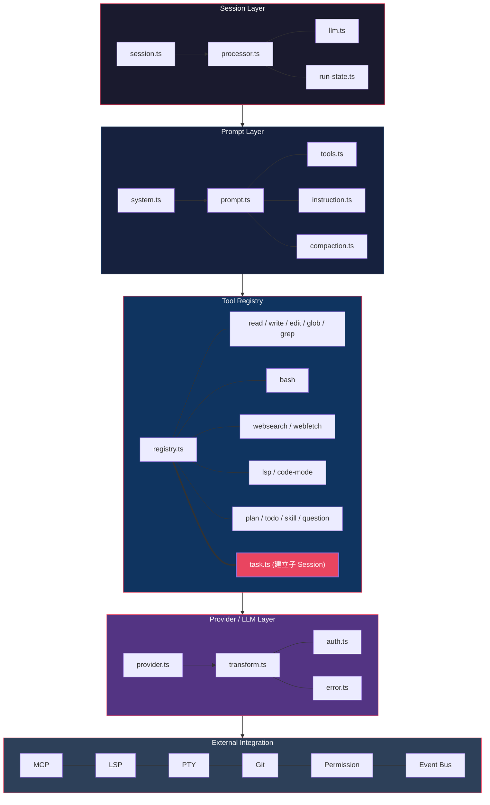
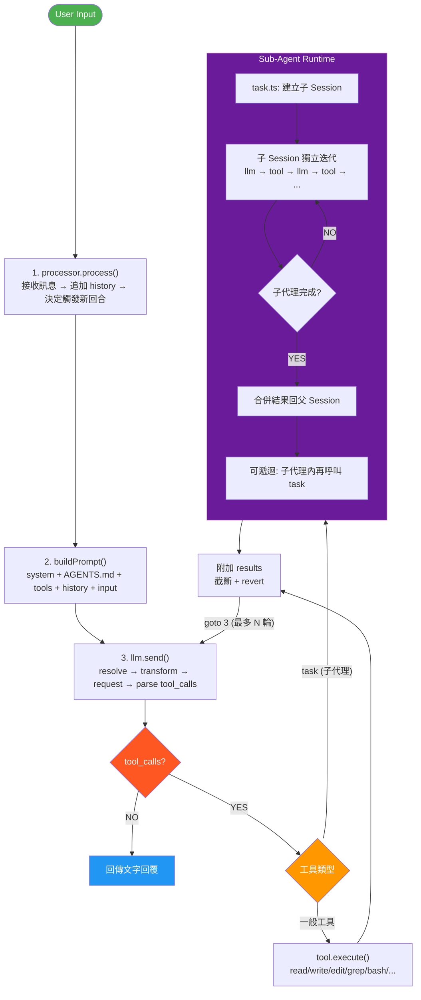

# OpenCode AI Agent 核心架構分析（去除前端層）

> 分析範圍：`packages/opencode/src/`，排除 CLI、TUI、Desktop、Web Console 等前端介面。

---

## 一、Agent 主迴圈（Session Layer）

| 檔案 | 職責 |
|---|---|
| `session/session.ts` | Session 生命週期管理（create, resume, fork, close） |
| `session/processor.ts` | **核心處理管線** — 收到使用者訊息 → 呼叫 LLM → 解析 tool calls → 執行工具 → 回饋結果 → 重複，直到完成 |
| `session/llm.ts` | LLM 呼叫協調（決定何時發送、何時停止、何時需要重試） |
| `session/run-state.ts` | Agent 執行狀態機（running, waiting_tool, done, error） |
| `session/retry.ts` | 錯誤重試邏輯 |
| `session/revert.ts` | 復原/撤銷（undo tool call） |
| `session/overflow.ts` | Context 溢出處理（觸發 compaction） |
| `session/status.ts` | Session 狀態定義 |

---

## 二、Prompt 建構（System Prompt + 工具注入）

| 檔案 | 職責 |
|---|---|
| `session/system.ts` | 建構 system prompt（角色設定 + 工具定義 + skill 描述） |
| `session/prompt.ts` | 建構完整 prompt（system + 歷史訊息 + 新輸入） |
| `session/instruction.ts` | 載入 AGENTS.md / CLAUDE.md / .opencode 指令 |
| `session/reminders.ts` | Session 提醒機制 |
| `session/tools.ts` | 工具定義注入到 LLM request 的 `tools` 參數 |
| `session/compaction.ts` | Context 壓縮（摘要舊訊息，保留近期） |
| `session/summary.ts` | 產生 session 摘要 |
| `session/todo.ts` | TODO 管理 |
| `session/message.ts` / `message-v2.ts` | Message 資料結構與序列化 |

---

## 三、Tool Registry（所有可用的工具）

| 工具名稱 | 檔案 | 功能 |
|---|---|---|
| read | `tool/read.ts` | 讀取檔案內容 |
| write | `tool/write.ts` | 寫入檔案 |
| edit | `tool/edit.ts` | 編輯檔案（string replacement） |
| glob | `tool/glob.ts` | 檔名模式搜尋 |
| grep | `tool/grep.ts` | 檔案內容搜尋 |
| bash | `tool/shell/` | Shell 命令執行 |
| apply_patch | `tool/apply_patch.ts` | 套用 diff patch |
| task | `tool/task.ts` | **子代理** — 建立子 session 執行獨立任務 |
| skill | `tool/skill.ts` | 載入並執行 Skill |
| plan | `tool/plan.ts` | 計劃模式（read-only agent） |
| question | `tool/question.ts` | 向使用者提問 |
| websearch | `tool/websearch.ts` | 網路搜尋 |
| webfetch | `tool/webfetch.ts` | 擷取 URL 內容 |
| code-mode | `tool/code-mode.ts` | 執行程式碼片段 |
| lsp | `tool/lsp.ts` | LSP 查詢（跳轉定義、參考等） |
| todo | `tool/todo.ts` | TODO 寫入 |
| mcp-websearch | `tool/mcp-websearch.ts` | 透過 MCP 的網路搜尋 |
| registry | `tool/registry.ts` | **工具註冊中心** — 管理工具列表、schema 生成 |
| tool | `tool/tool.ts` | 工具介面定義 |
| schema | `tool/schema.ts` | 工具 JSON Schema 驗證 |
| truncate | `tool/truncate.ts` | 工具輸出截斷 |

---

## 四、Provider / LLM Layer

| 檔案 | 職責 |
|---|---|
| `provider/provider.ts` | **Provider 抽象層** — 統一介面給所有 LLM provider |
| `provider/transform.ts` | Request/response 轉換（內部格式 ↔ 各 provider API 格式） |
| `provider/auth.ts` | Provider 認證管理 |
| `provider/error.ts` | Provider 錯誤處理與 fallback |
| `provider/model-status.ts` | 模型狀態追蹤（可用性、速率限制） |

---

## 五、外部整合層

| 模組 | 路徑 | 職責 |
|---|---|---|
| MCP | `mcp/` | Model Context Protocol client — 連接外部 MCP server |
| LSP | `lsp/` | Language Server Protocol client — 程式碼語意分析 |
| PTY | `pty/` | Pseudo-terminal — shell 執行環境管理 |
| Git | `git/` | Git 操作（diff, status, commit） |
| File | `file/` | 檔案監控、ignore patterns、ripgrep 整合 |
| Permission | `permission/` | 權限評估引擎（allow / ask / deny） |
| Skill | `skill/` | Skill 探索與載入 |
| Bus | `bus/` | 內部事件匯流排（跨模組通訊） |
| Effect | `effect/` | Dependency injection + runtime（Effect-TS service registry） |
| Config | `config/` | 設定檔解析與管理 |

---

## 六、Agent 定義

| 檔案 | 職責 |
|---|---|
| `agent/agent.ts` | 內建 agent 定義（build / plan / general），各自綁定不同工具集與行為 |
| `agent/subagent-permissions.ts` | 子代理權限控制 |

---

## 七、Function 架構圖

---

## 八、Agent Process Flow

---

## 九、OpenCode Tools vs AI Agent Skills

| | OpenCode Tools | Skills（Claude Code / Pi） |
|---|---|---|
| **本質** | 程式化函式 + JSON Schema | Markdown 說明文件（SKILL.md） |
| **啟動方式** | LLM 直接呼叫（native function calling） | LLM 必須先 `read` 工具來讀檔案 |
| **執行** | TypeScript 程式碼直接執行，回傳結構化結果 | LLM 讀完後照說明操作，自行決定下一步 |
| **Schema** | 嚴格的 input/output JSON Schema | 無 schema，純自然語言描述 |
| **負責方** | 程式負責執行，LLM 只提供參數 | LLM 負責理解+執行全部步驟 |
| **複雜度** | 單一操作（讀檔、寫檔、搜尋） | 可包含多步驟指令、腳本、條件邏輯 |
| **可測試性** | 高（unit test 直接測工具函式） | 低（依賴 LLM 行為） |

**一句話**：Tools 是 LLM **呼叫**的函式（LLM 是 caller），Skills 是 LLM **閱讀**的說明書（LLM 是 executor）。OpenCode 中比較接近 skill 概念的是 `task` tool（子代理），它讓 LLM 建立獨立子 session 來執行多步驟任務。

---

> 原始碼位置：https://github.com/anomalyco/opencode/tree/dev/packages/opencode/src
>
> 核心依賴：Effect-TS（runtime/DI）、@ai-sdk/*（provider adapter）、Drizzle ORM（persistence）
