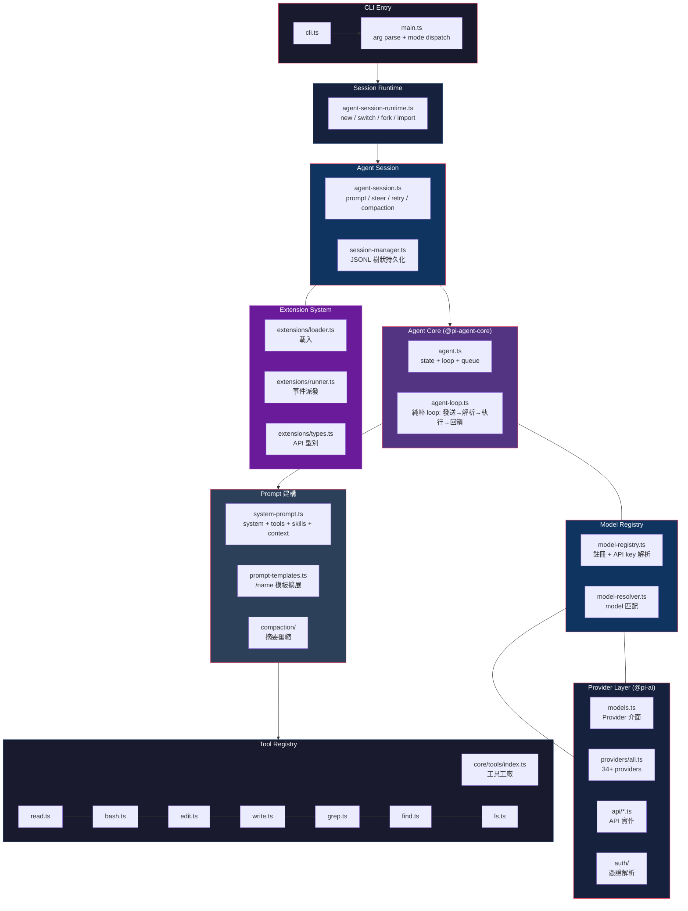
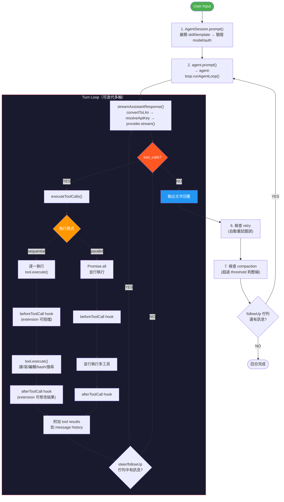

# Pi Coding Agent 核心架構分析

> 分析範圍：`packages/coding-agent/`，排除 TUI 前端層。基於 `@earendil-works/pi-coding-agent`。
>
> 原始碼：https://github.com/earendil-works/pi/tree/main/packages/coding-agent

---

## 一、Agent 主迴圈（Session Layer）

| 檔案 | 職責 |
|---|---|
| `core/agent-session.ts` | **中央 session 類別** — prompt 生命週期、steer/followUp、retry、compaction、model 管理、tool registry |
| `core/agent-session-runtime.ts` | Session 生命週期包裝（new, switch, fork, import） |
| `core/agent-session-services.ts` | 服務工廠與型別定義 |
| `core/session-manager.ts` | JSONL 持久化、樹狀 session、分支管理 |
| `core/slash-commands.ts` | 內建 slash command 定義 |

---

## 二、Prompt 建構（System Prompt + 工具注入）

| 檔案 | 職責 |
|---|---|
| `core/system-prompt.ts` | 建構 system prompt — 角色 + 工具列表 + AGENTS.md + skills + 日期 |
| `core/prompt-templates.ts` | 基於檔案的 prompt template 擴展（`/name`） |
| `core/messages.ts` | Message 型別定義與建立 helper |
| `core/compaction/compaction.ts` | Context 壓縮（摘要舊訊息） |
| `core/compaction/branch-summarization.ts` | 分支切換時的摘要 |
| `core/skills.ts` | Skill 載入與格式化 |
| `core/context.ts` (via extension events) | Extension 可在每次 LLM call 前修改 context |

---

## 三、Tool Registry（所有內建工具）

| 工具名稱 | 檔案 | 功能 |
|---|---|---|
| read | `core/tools/read.ts` | 讀取檔案，支援 offset/limit，圖片 auto-resize |
| bash | `core/tools/bash.ts` | 執行 shell 命令，支援 timeout、detached process |
| edit | `core/tools/edit.ts` | 精確文字取代（oldText/newText），自動產生 diff |
| write | `core/tools/write.ts` | 寫入檔案（自動建立目錄） |
| grep | `core/tools/grep.ts` | 透過 ripgrep 搜尋檔案內容 |
| find | `core/tools/find.ts` | 透過 fd 找檔案（glob 模式） |
| ls | `core/tools/ls.ts` | 列出目錄內容 |
| — | `core/tools/index.ts` | 工具工廠：`createAllTools()`, `createCodingTools()`, `createReadOnlyTools()` |
| — | `core/tools/truncate.ts` | 工具輸出截斷共用邏輯 |
| — | `core/tools/tool-definition-wrapper.ts` | `ToolDefinition` → `AgentTool` 轉接器 |

---

## 四、Provider / LLM Layer

Provider 實作在獨立 package `@earendil-works/pi-ai`：

| 檔案 | 職責 |
|---|---|
| `packages/ai/src/models.ts` | **Provider 介面定義** — `stream()`, `streamSimple()`, `getModels()` |
| `packages/ai/src/types.ts` | 核心型別（Model, Context, AssistantMessage, Usage） |
| `packages/ai/src/providers/all.ts` | 34 個內建 provider 註冊 |
| `packages/ai/src/api/*.ts` | 各 provider API 實作（Anthropic Messages, OpenAI Responses, Google Gemini 等） |
| `packages/ai/src/auth/` | Auth context、credential store、resolve 邏輯 |
| `core/model-resolver.ts` | Model 解析、pattern 匹配、預設 model 對應 |
| `core/model-registry.ts` | Provider/model 註冊中心、API key 解析、OAuth、自訂 model |
| `core/auth-storage.ts` | API key / OAuth 憑證儲存 |

### 內建 34+ Provider

Anthropic、OpenAI、Google Gemini、Google Vertex、Azure OpenAI、Amazon Bedrock、DeepSeek、Mistral、Groq、Cerebras、xAI (Grok)、GitHub Copilot、OpenRouter、Together、Fireworks、NVIDIA、HuggingFace、Cloudflare Workers AI、Cloudflare AI Gateway、Kimi Coding、MiniMax、MoonshotAI、Xiaomi、Z.AI、OpenCode、OpenCode Go、Vercel AI Gateway、Ant Ling、Ollama（透過自訂 model）等。

---

## 五、Extension 系統

Pi 的擴充性核心。Extension 是 TypeScript 模組，匯出 factory function `(pi: ExtensionAPI) => void`。

| 檔案 | 職責 |
|---|---|
| `core/extensions/types.ts` | **所有 extension API 型別定義**（~1500 行） |
| `core/extensions/runner.ts` | **Extension runner** — 事件派發、context 建立、生命週期管理 |
| `core/extensions/loader.ts` | Extension 載入（透過 jiti 或虛擬模組） |
| `core/extensions/wrapper.ts` | Extension 工具包裝（`wrapRegisteredTool()`） |
| `core/resource-loader.ts` | 載入 extensions、skills、prompts、themes、context files |

### Extension 可註冊項目

- **Tools**: `registerTool(definition)` — 新增或取代內建工具
- **Commands**: `registerCommand(name, options)` — 自訂 `/command`
- **Shortcuts**: `registerShortcut(keyId, options)` — 自訂快捷鍵
- **Flags**: `registerFlag(name, options)` — 自訂 CLI flag
- **Providers**: `registerProvider(name, config)` — 自訂 LLM provider
- **Event Hooks**: `on(event, handler)` — 攔截 30+ 種事件

### 可用 Extension Events

| 類別 | 事件 |
|---|---|
| Lifecycle | `project_trust`, `resources_discover`, `session_start`, `session_shutdown`, `agent_start`, `agent_end` |
| Turn | `turn_start`, `turn_end` |
| Message | `message_start`, `message_update`, `message_end` |
| Tool | `tool_call`, `tool_result`, `tool_execution_start/update/end` |
| Model | `model_select`, `thinking_level_select` |
| Session | `session_info_changed`, `session_before_switch/fork/compact/tree`, `session_compact`, `session_tree` |
| Provider | `before_provider_request`, `before_provider_headers`, `after_provider_response` |
| Input | `input`（預 prompt）, `user_bash`（!cmd 前） |
| Context | `context`（每次 LLM call 前，可修改 messages） |

---

## 六、外部整合層

| 模組 | 路徑 | 職責 |
|---|---|---|
| Skill | `core/skills.ts` | Skill 探索與載入（.pi/skills/） |
| Prompt Templates | `core/prompt-templates.ts` | 檔案式 prompt template 擴展 |
| Theme | `modes/interactive/theme/` | TUI 主題系統 |
| Package Manager | `core/package-manager.ts` | npm/git package 安裝管理 |
| Event Bus | `core/event-bus.ts` | Extension 間通訊 |
| Project Trust | `core/project-trust.ts` | 專案信任管理 |
| Bash Executor | `core/bash-executor.ts` | 使用者 `!cmd` 執行 |
| Git | `utils/git.ts` | Git 操作工具 |

---

## 七、Function 架構圖

---

## 八、Agent Process Flow

---

## 九、Pi Tools vs 一般 AI Agent Skills

| | Pi Tools | Skills（Claude Code / Pi） |
|---|---|---|
| **本質** | 程式化函式 + JSON Schema（TypeBox） | Markdown 說明文件（SKILL.md） |
| **啟動方式** | LLM 直接 native function calling | LLM 必須先 `read` 工具來讀檔案 |
| **執行** | 程式碼直接執行，回傳結構化結果 | LLM 讀完後照說明操作 |
| **Schema** | 嚴格定義的 `input`/`output` JSON Schema | 無 schema，純自然語言描述 |
| **擴充性** | Extension 可用 `registerTool()` 新增 | 放在 `skills/` 目錄即自動載入 |
| **複雜度** | 單一操作（讀檔、寫檔、搜尋） | 可包含多步驟指令、腳本 |
| **自訂渲染** | 支援 `renderCall` / `renderResult` TUI | 無（純文字） |

**一句話**：Pi 的 Tools 是 LLM 直接呼叫的函式，Skills 是 LLM 閱讀後自行操作的說明書。但 Pi 的 Extension 系統可以註冊任意自訂工具，模糊了兩者界線。

---

## 十、Pi vs OpenCode 架構對照

| 面向 | Pi | OpenCode |
|---|---|---|
| **核心語言** | TypeScript（Node.js） | TypeScript + Go（CLI） |
| **Agent loop** | `@pi-agent-core`（獨立 package） | Effect-TS 自幹 |
| **Tool 數量** | 7 個內建（read/bash/edit/write/grep/find/ls） | 17 個內建（含 sub-agent、skill、plan 等） |
| **Provider** | 34+ 個內建（`@pi-ai`） | 透過 `@ai-sdk/*` |
| **Extension** | TypeScript factory + 30+ event hooks | 無（修改原始碼 or plugin 系統） |
| **Sub-agent** | 無內建（可透過 extension 實作） | `task` tool 原生支援 |
| **Session** | JSONL 樹狀結構（單檔多分支） | SQLite（Drizzle ORM） |
| **Persistent** | 無 DB，純檔案 | SQLite 資料庫 |
| **Compaction** | 內建自動/手動壓縮 | 內建自動/手動壓縮 |
| **MCP** | 無內建（extension 可加） | 內建 MCP client |
| **LSP** | 無 | 內建 LSP client |
| **Skill** | `skills/` 目錄 + `/skill:name` | `skill/` 目錄 + `tool/skill.ts` |
| **Design** | 極簡核心，全用 extension 擴充 | 豐富內建功能 |

---

> 原始碼位置：https://github.com/earendil-works/pi/tree/main/packages/coding-agent/src
>
> 核心依賴：TypeBox（tool schema）、jiti（extension 載入）、@earendil-works/pi-ai（providers）
